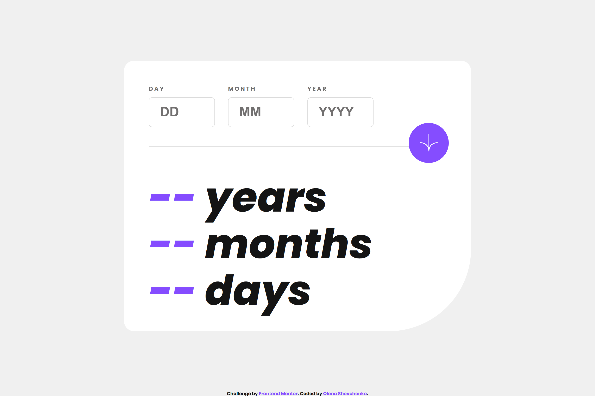

# Frontend Mentor - Age calculator app solution

This is a solution to the [Age calculator app challenge on Frontend Mentor](https://www.frontendmentor.io/challenges/age-calculator-app-dF9DFFpj-Q). Frontend Mentor challenges help you improve your coding skills by building realistic projects. 

## Table of contents
  - [The challenge](#the-challenge)
  - [Screenshot](#screenshot)
  - [Links](#links)
  - [Built with](#built-with)
  - [What I learned](#what-i-learned)

### The challenge

Users should be able to:

- View an age in years, months, and days after submitting a valid date through the form
- Receive validation errors if:
  - Any field is empty when the form is submitted
  - The day number is not between 1-31
  - The month number is not between 1-12
  - The year is in the future
  - The date is invalid e.g. 31/04/1991 (there are 30 days in April)
- View the optimal layout for the interface depending on their device's screen size
- See hover and focus states for all interactive elements on the page
- **Bonus**: See the age numbers animate to their final number when the form is submitted

### Screenshot




### Links

- Solution URL: (https://github.com/olenahelena/Age_Calculator_App)
- Live Site URL: ()

### Built with

- Semantic HTML5 markup
- SCSS
- Flexbox
- CSS Grid
- Mobile-first workflow

### What I learned

This task was perfect for practicing with JavaScript. I learned more about functions and worked extensively with Date objects. I also discovered that in JavaScript's Date constructor, the month parameter is zero-based, which means that January is represented as 0, and February as 1. Therefore, when working with Date objects in a function, it's important to subtract 1 from the 'monthInt' variable to get the correct month representation

```js
const givenDate = new Date(yearInt, monthInt - 1, dayInt);
```